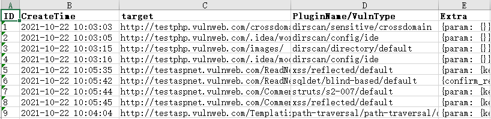

# xray 

将`xray `多个 `html`格式的扫描结果转为 `xlsx` 结果，指定扫描结果路径即可（扫描结果路径下不能包含其他文件）。


```shell
  _    _ _             _   _               _
 | |  | | |           | | | |             | |
 | |__| | |_ _ __ ___ | | | |_ ___   __  _| |_____  __
 |  __  | __| '_ ` _ \| | | __/ _ \  \ \/ / / __\ \/ /
 | |  | | |_| | | | | | | | || (_) |  >  <| \__ \>  <
 |_|  |_|\__|_| |_| |_|_|  \__\___/  /_/\_\_|___/_/\_


eg: python html_to_xlsx.py results
    python html_to_xlsx.py D:\test\results
```


